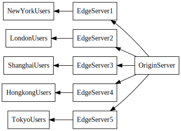
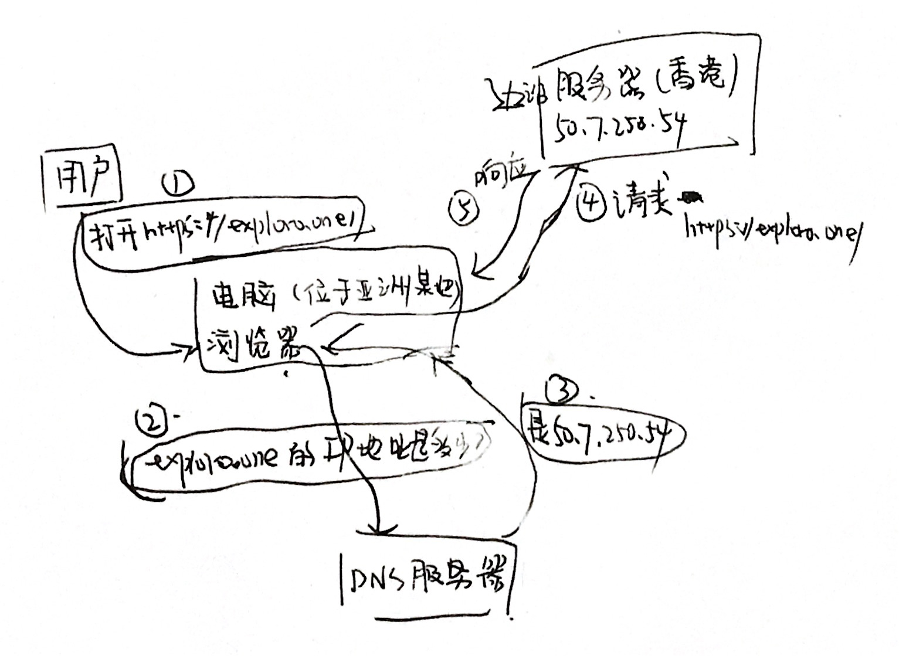
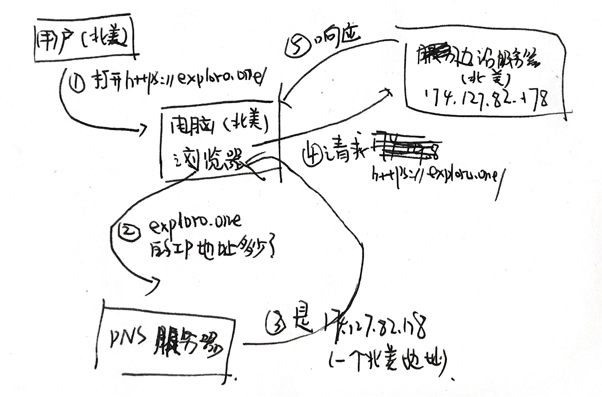
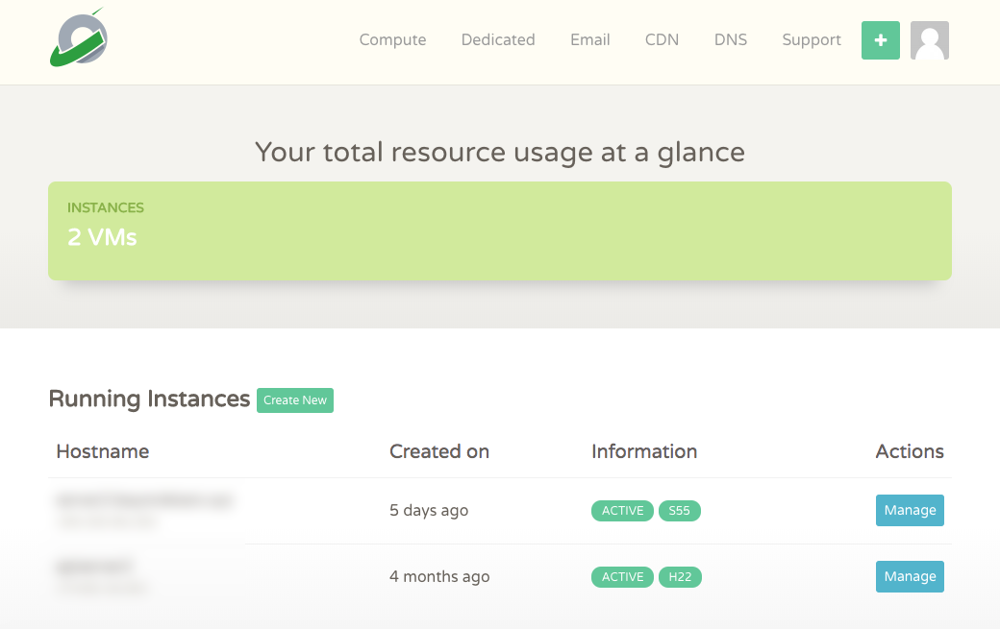
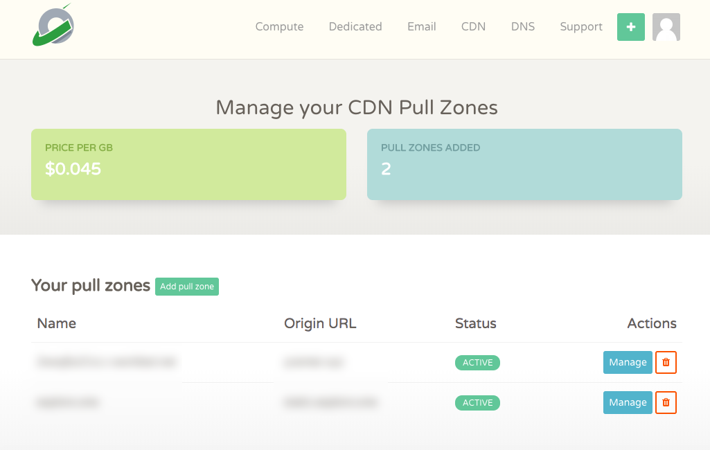
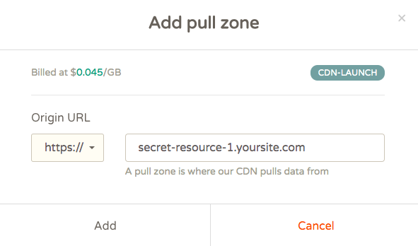
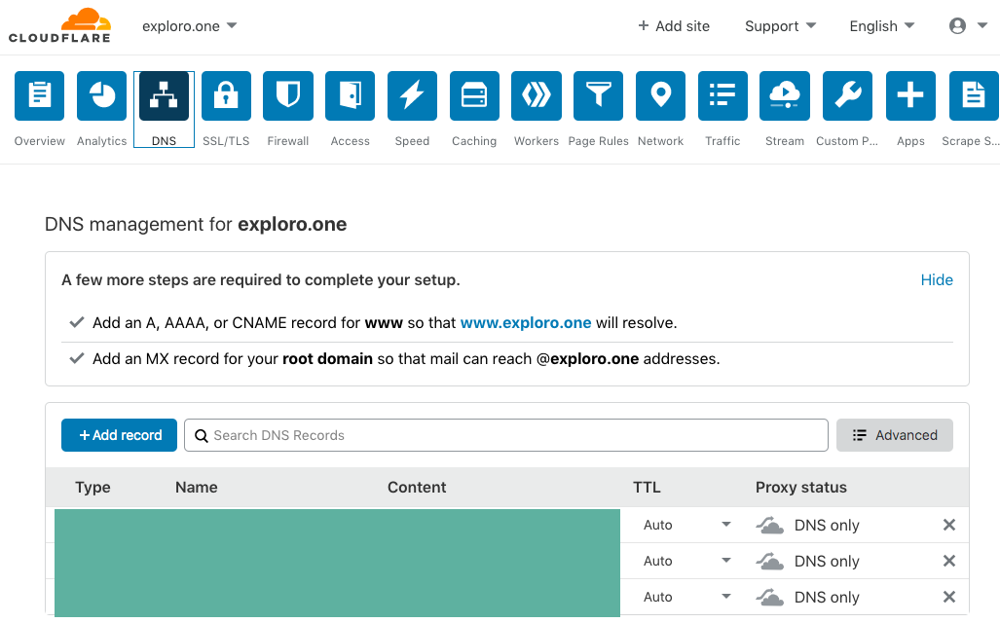
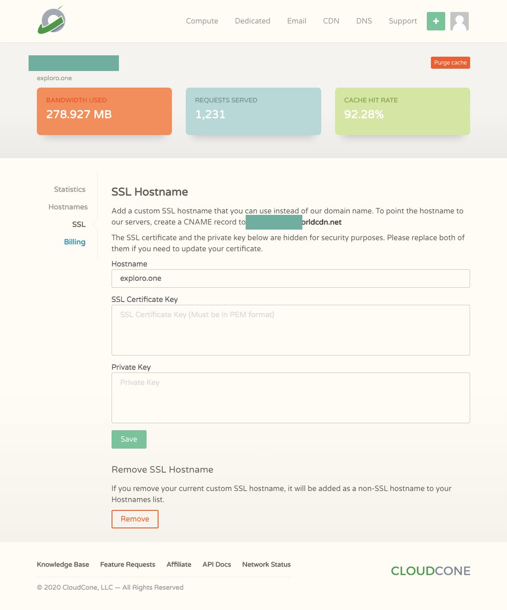
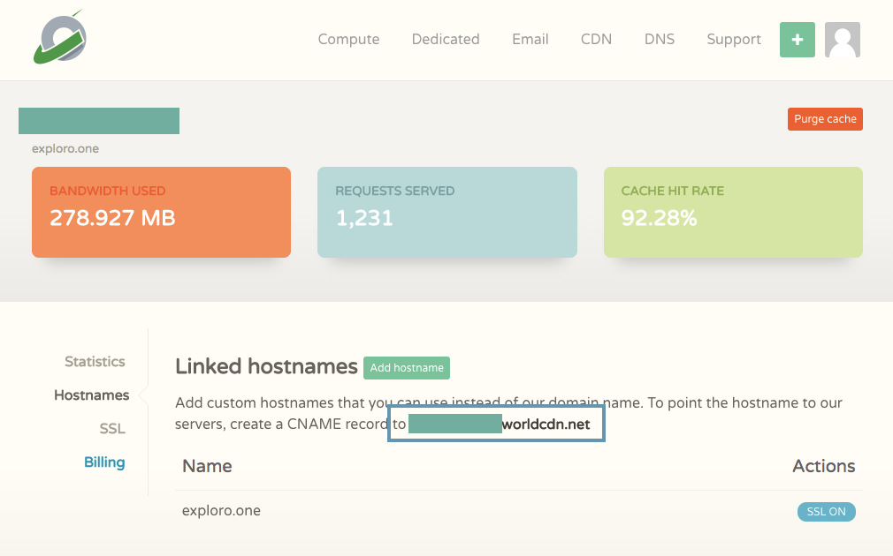
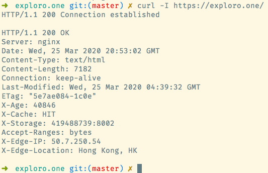

# CDN部署过程全记录：原理和实践

*写于 2020 年 3 月 25 日：*

## 前言

突然想尝试一下部署 CloudCone 的 CDN，这也是我第一次部署 CDN，于是就有了这篇文章.

## 什么是CDN

### 单机缓存的局限性

我们假设你已经有了计算机网络这方面的基本知识．一般来说用户的计算机和网页服务器之间呢会不可避免地有着一段物理距离，比如说人在广州的一台计算机上访问一个网站，而这个网站的服务器却位于日本甚至美国西海岸，那么请求从浏览器发出，到服务器收到请求，制备网页，发回响应，浏览器收到响应，这个过程其实是会经过比较长（也就是意味着可缩短的）的时间的．我们希望找到一种办法，能够让这个请求发到服务器再到浏览器收到响应的这个过程所消耗的时间减短一些，这样用户打开网页的速度就会更快一些.

### 内容分发网络

CDN的全称呢就是Content Delivery Network，即「内容分发网络」，顾名思义，就是通过网络将内容分发，分发到哪里去呢？回归我们刚才的讨论，当时是希望分发得离用户越近越好，最好是服务器和每个用户的距离（延时）都不那么远，这样用户即使是第一次打开网页，本地没有缓存，要直接请求服务器，也不会费太多时间.



这样呢，不管用户在哪个大洲，我们都有和用户比较近的服务器，使用户浏览器发出的请求不必跋山涉水大老远地跑到源服务器上，这样就使用户打开网页的时间加快了：通过在用户的家门口假设一些 Edge Server，并且提前把内容分发到这些 Edge Server 上．有了 Edge Server ，用户请求网页时，比如说用的是域名，www.example.com，DNS服务器就根据用户的 IP 地址，判断用户的地理位置，再根据用户的地理位置，返回离用户最近的那个 Edge Server 的 IP 地址，比如说 EdgeServer1 的 IP 地址，然后用户再向 EdgeServer1 这台边沿服务器请求 www.example.com 的内容．这就是CDN工作的大概过程.

## CDN工作的具体方式

现在我们仅仅是知道CDN有一些「边沿服务器」离用户离得比较近，用户请求网页向边沿服务器请求而不是向源服务器请求，从而加快了速度，但这一切是怎么实现的呢？事实上，可以有多种实现方法，我们只说其中一种，但是它们的底层思想是想通的.

### 从用户在浏览器地址栏敲下地址那一刻

用户首先打开网页浏览器，例如说Google Chrome/Mozilla Firefox/Microsoft Edge，然后单击一下地址栏，在地址栏中输入一串字符：

```
exploro.one
```

浏览器自动地将域名

```
exploro.one
```

补充成完整的URL

```
https://exploro.one/
```

浏览器解析这条完整的URL，浏览器得到以下信息

```
{
    "协议": "https",
    "主机名称": "exploro.one",
    "请求路径": "/",
    "请求方法": "GET"
}
```

翻译过来是，向`exploro.one`这台主机，通过`https`协议，请求这台网页服务器位于`/`的资源.

接下来我们不会详细解释HTTPS协议，我们只需知道浏览器所在的这台机器，和`exploro.one`这个域名所代表的机器，是通过HTTPS协议进行通信就行了，可以理解为浏览器和`exploro.one`这台服务器在「谈话」，他们用的「语言」是「HTTPS语言」(Although there no such thing like HTTP语言)．但是，根据互联网协议(Internet Protocol，IP)，网络中的两台机器要能够互相通信，得知道他们的「地址」，也就是IP地址才行，可是目前浏览器只知道对方叫`exploro.one`，并不知道`exploro.one`这台服务器的「地址」，也就是并不知道`exploro.one`这台服务器的IP地址啊，浏览器要向`exploro.one`发送「数据包」或者「报文」(message)才能开始和`exploro.one`进行「谈话」，就像是两个人谈话，至少应该是面对面的，不能对着天空或者背对着说话．这就到了CDN实现的关键了——浏览器知道要向谁（名称）发送请求，但是具体往哪（地址）发的问题.

### DNS——电话本或者叫地址簿

DNS的全称是Domain Name System，域名系统，或者简称DNS，我们知道`exploro.one`其实是一个域名，DNS字面意义上理解就是一个系统，这个系统负责将一个「域」(Domain)的「名字」(Name)转化为实际的「地址」．我们可以不去理解什么叫做「域」，也可以暂时不去研究DNS的具体的实现方式和工作原理，只需知道丢给DNS一个名字，DNS就会吐出对应于这个名字的地址出来，就够了．比如说我们想知道

```
www.google.com
```

这个域名对应的地址，可以在终端运行：

```
dig +short www.google.com A
```

敲回车，会看到终端回答

```
172.217.14.100
```

这个被3个点分隔开来的四个数字，就确定了`www.google.com`的一个地址（众多地址中的一个）.

再试着执行

```
dig +short cloudflare.com A
```

会看到

```
104.17.175.85
104.17.176.85
```

其中`104.17.175.85`和`104.17.176.85`都是`cloudflare.com`的地址，一个域名可以有多个「地址」，就好像一家公司也可以有多家「仓库」的地址或者多个「办公地址」一样．IP地址就是互联网意义下的「地址」．对DNS的介绍，就暂时到这.

### 浏览器开始向服务器发起请求

回答我们开始介绍DNS之前，浏览器要向服务器发起请求了，有了DNS，浏览器就知道怎么由`exploro.one`这个名字得到有意义的IP地址了，这里有个插曲，实际上由当我们

```
dig +short exploro.one A
```

的时候，实际上也得有一个服务器，我们把它叫做「DNS服务器」，来回答「问题」(query)，来回答(answer)「exploro.one是的IP地址是多少？」这个问题(query)．这和CDN的实现又有什么关系呢？——大大地有关系.

设想现在我们实现的CDN系统有4个边沿服务器，一台位于香港

```
50.7.250.54  # 位于香港
```

另外三台分布在北美各地

```
174.127.82.178  # Texas
205.251.145.6  # 北美
64.22.104.7  # 北美
```

那么为了让用户请求`exploro.one`时，浏览器得到的地址所对应的服务器总是是和用户最接近的，这个「DNS服务器」实际上可以这样，它实现一个查询事件的处理程序：

```
function 当有DNS查询请求来临(查询) {
    如果 查询的对象是`exploro.one`的地址 那么:
        如果 查询的发起地是 亚洲 那么:
            返回 50.7.250.54 # 这是香港边沿服务器的地址
            结束
        否则 如果 查询的发起地是 北美 那么:
            返回 174.127.82.178  
            和 205.251.145.6   
            和 64.22.104.7  # 这三个都是北美边沿服务器的地址
            结束
}
```

简单地说，当DNS服务器被问询「exploro.one的地址是多少」这个问题时，它会先看询问人——也就是浏览器的IP地址对应的位置，如果浏览器是运行在位于亚洲的一台电脑上，那么这个DNS服务器就返回香港边沿服务器的地址 `50.7.250.54`，如果浏览器是运行在位于北美的一台电脑上，那么DNS服务器返回这三个北美边沿服务器的地址 `174.127.82.178` 和 `205.251.145.6` 和 `64.22.104.7` 作为回答．

这样一来，当亚洲的用户访问`exploro.one`时，浏览器由于得到的是 `50.7.250.54`，它就会向`50.7.250.54`请求`/`这个资源，当北美的用户访问`exploro.one`时，浏览器由于得到的地址会是`174.127.82.176`或者`205.251.145.6`或者`64.22.104.7`这三个地址中的其中一个，由于这三个地址都是北美边沿服务器的地址，浏览器会向位于北美的边沿服务器请求`/`这个资源.

上面这整个过程，画出图形，就是这样子的：





这就完成了对CDN的最基本的工作的方式的介绍.

## 为自己的网站配置CDN

刚才那两幅图，不管是亚洲用户也好，还是北美用户也好，在请求`https://exploro.one`时，浏览器得到的都只是边沿服务器，分别是香港边沿服务器和北美边沿服务器的IP地址，而浏览器始终看不到`exploro.one`的真正的源站点，这样，CDN除了能加快用户打开网站的速度之外，还起到了隐藏源服务器真实IP地址的作用，给源服务器又加了一层安全防护.

用户事实上并不需要关心浏览器到底是向具体哪一个边沿服务器发起请求，只知道，一般都是最近的边沿服务器就够了，那么，从用户的角度上看，所有那么多边沿服务器总是可以抽象成一台抽象的离自己最近的一台抽象的「抽象边沿服务器」或者也叫「最近边沿服务器」，并且最近边沿服务器的地址已知，而真实源站点的地址未知（但是边沿服务器知道或者间接知道源站点的地址）.


回忆上一节讨论的CDN的最基本工作方式，我们知道，DNS在CDN的工作过程中扮演了一个重要的角色——根据查询的发起地的地理位置返回距离最近的边沿服务器的IP地址．那么总的来说，要在一个已经实现好了的CDN系统上面配置自己的网站，实际上无非主要是两个方面：1）让边沿服务器知道网站的源服务器在哪（用于更新缓存）；2）让DNS服务器知道边沿服务器的地址都有哪些（这样DNS服务器在面临查询时才可以从多个服务器中选位置最近的作为回答）.

下面，我们以一款名为[CloudCone Cloud Nexus](https://app.cloudcone.com/?ref=4700)的CDN系统和一款名为[CloudFlare Managed DNS](https://www.cloudflare.com/dns/)的DNS服务器的实现为例，演示`exploro.one`这个网站的CDN配置过程.

### 为边沿服务器设置拉取源

[CloudCone Cloud Nexus](https://app.cloudcone.com/?ref=4700)其实是一款Pull CDN，叫做Pull CDN其实是为了区别于Push CDN，Pull CDN的边沿服务器默认情况下什么都不做，当收到请求时，边沿服务器会检查自己的缓存，如果缓存中有和当前请求匹配的条目，就拿出自己的缓存来响应请求，若是没有缓存或者有但是缓存已经过期，边沿服务器就会向源服务器发起缓存更新请求，源服务器会向边沿服务器返回最新的内容作为缓存更新请求的响应，边沿服务器检视来自源服务器的响应，如果这个响应是可缓存的，那就缓存起来以备下次请求作为响应，并且将这个响应内容再返回给客户端的浏览器．

Pull CDN的优点是配置简单，只需一次设置源服务器的IP地址，并且适当的在源服务器设置内容的缓存有效期，之后一切都会工作得很好．但是Pull CDN的边沿服务器在面对用户第一次发起请求时，由于并没有相应内容的缓存，还是要向源站点请求最新内容，所以对于访客数量不是那么大的站点，效果不如Push CDN好.

而Push CDN顾名思义其实就是指源服务器会主动地向边沿服务器推送自己的最新内容，这样任何时刻用户请求边沿服务器时，边沿服务器都有最新的缓存拿来作为响应，而无需再去向源站点请求最新内容，这样从用户的角度来看网站的平均打开速度会更快一些（相比Pull CDN），但是从网站管理员的角度来看，这样配置起来会比较复杂．所以我们今天只介绍Pull CDN，并且Pull CDN也是更为普遍更容易被接受的CDN的实现方式.

现在我们要配置边沿服务器当面临未缓存请求时该向哪个源服务器请求最新内容.

首先，打开[CloudCone Cloud Nexus](https://app.cloudcone.com/?ref=4700)，注册了账户之后进入登录页面，在登录页面输入自己注册的CloudCone账户和密码，并单击「Log in」（登录）.


登录之后可以看到控制面板资源总览界面如下：



可以看到整体上界面看起来还是非常简洁大方非常赏心悦目的．接下来我们单击上面哪一排字当中的「CDN」．进入到CDN Pull Zone设置页面.



其中Name和Origin URL字段最好保密，因为从这些信息攻击者有可能能够推断出你的网站的源站点的真实IP地址（而不是边沿服务器的IP地址）．然后我们单击「Add pull zone」按钮，位于「Your pull zones」标题的右边.



第一个选项是协议，建议选择`https://`，现今申请一个可靠的TLS证书并不难，然后我们假设你的博客网站是在

```
yoursite.com
```

即你希望用户在浏览器地址栏输入`yoursite.com`并且敲回车就能看到你的博客，那么这里的`secret-resource-1`是你自己设置的一串字母和数字的组合，不能太长，只要总的`secret-resource-1.yoursite.com`的长度不超过255个字符即可，但是这里的`secret-resource-1.yoursite.com`实际上是指向你的源站的真实IP的，所以也请务必保密.

接下来我们要在DNS服务器设置

```
secret-resource-1.yoursite.com
```

指向你的源站点的真实IP，所以请首先打开CloudFlare DNS，打开之后界面如下所示



点击「+ Add  record」按钮


将其中的`secret-resource-1`替换为你自己设置的字母数字字符串填到Name中，这里我只是做了个演示，然后Type选择A，即A记录，IPv4 address填你的网站的源站点的服务器的IP地址，这里我们假设你的源站点的IP地址是`123.124.125.126`，这个你要看你的网站的源服务器的VPS提供商界面显示的那个IP地址，TTL可以不用设置，即Auto（自动），然后Proxy status下方的云朵☁️建议点灰（否则设置起来还会比较麻烦），点Save保存.

然后我们登陆你的源站点的VPS服务器，设置一下TLS证书和Nginx服务器，

```
ssh root@123.124.125.126
```

首先安装[acme.sh](https://github.com/acmesh-official/acme.sh)，

```
curl https://get.acme.sh | sh
```

安装完成后退出SSH并且重新登陆（否则可能出现找不到命令的情况），是为了SHELL重新加载PATH缓存，然后先为源站点创建一个Nginx虚拟服务器，首先创建源站点的目录

```
mkdir -p /var/www/secret-resource-1.yoursite.com
```

然后把你现在的网站的资源全都复制过去（我们假设你的网站是静态网站）

```
cp -R /var/www/yoursite.com/* /var/www/secret-resource-1.yoursite/
```

然后在Nginx为这个`secret-resource-1.yoursite.com`这个虚拟服务器做一下适当的配置

```
cd /etc/nginx/conf.d
vi yoursite.com.conf
```

在`yoursite.com.conf`文件添加下面这些内容

```
server {
    listen 80;
    server_name secret-resource-1.yoursite.com;
    root /var/www/secret-resource-1.yoursite.com;
}
```

保存并退出VI编辑器，让`nginx`更新配置

```
nginx -s reload
```

接下来借助`acme.sh`为`secret-resource-1.yoursite.com`申请证书

```
acme.sh --issue -d secret-resource-1.yoursite.com -w /var/www/secret-resource-1.yoursite.com
```

如果申请成功，证书默认情况下会位于

```
$HOME/.acme.sh/secret-resource-1.yoursite.com/
```

这个文件夹，下面我们在Nginx中为源站点虚拟服务器启用HTTPS，首先打开配置文件

```
cd /etc/nginx/conf.d
vi yoursite.com.conf
```

添加以下内容

```
server {
    listen 443 ssl;
    server_name secret-resource-1.yoursite.com;
    ssl_certificate /root/.acme.sh/beyondstars.xyz/beyondstars.xyz.cer;
    ssl_certificate_key /root/.acme.sh/beyondstars.xyz/beyondstars.xyz.key;
    ssl_protocols TLSv1 TLSv1.1 TLSv1.2; # 如果Nginx支持TLSv1.3也可以把TLSv1.3加进去

    etag on; # 缓存配置

    root /var/www/secret-resource-1.yoursite.com;

    location / {
        add_header Strict-Transport-Security "max-age=31536000" always; # 开启HSTS，强制请求必须是HTTPS，然后待会记得把80端口的那个用于验证的虚拟服务器删掉.
        add_header Cache-Control "public; max-age=259200; stale-while-revalidate=259200; stale-if-error=31536000"; 
        # 普通资源缓存有效期3天.
    }

    location ~* \.(jpe?g|png|gif|ico|js|svg|bin)$ {
        add_header Cache-Control "public; max-age=2592000; stale-while-revalidate=2592000; stale-if-error=31536000";
        # 静态资源缓存有效期为30天
    }

}
```

保存并退出VI编辑器，让nginx更新配置

```
nginx -s reload
```

如果一切没问题，以上这条命令不会有任何提示信息出现．这样我们的源服务器就启动完毕了．并且也也配置好了边沿服务器，边沿服务器已经知道源服务器再哪了.

接下来回到CloudCone CDN的配置界面，点击「Manage」按钮，再点击「SSL」，配置裸域名的证书：



其中Hostname就填自己的博客的域名，比如说你的是

```
yoursite.com
```

然后我们再一次地`ssh`到你的博客的源站点的VPS服务器，

```
ssh root@123.124.125.126
```

把博客网站`yoursite.com`的TLS证书翻出来

```
### 如果你的博客是用Let's Encrypt申请的证书
cat /etc/letsencrypt/live/yoursite.com/fullchain.pem # 证书
cat /etc/letsencrypt/live/yoursite.com/privkey.pem # 私钥

```

或者

```
### 如果你的博客是用Let's Encrypt申请的证书
cat /root/.acme.sh/yoursite.com/yoursite.com.cer # 证书
cat /etc/letsencrypt/live/yoursite.com/yoursite.com.key # 私钥

```

然后`fullchain.pem`或者`yoursite.com.cer`的内容粘贴到SSL Certificate Key下面的文本框，而`privkey.pem`或者`yoursite.com.key`的内容粘贴到Private Key下面的文本框，需要注意的是，证书和私钥是要配套的，也就是说，Let's Encrypt的证书要配套Let's Encrypt生成的私钥，而acme.sh的证书要配套acme.sh生成的私钥．完事后点Save按钮.

刚才我们做的这些，复制粘贴证书什么的，其实就是把博客网站`yoursite.com`的TLS证书复制粘贴到CloudCone CDN的边沿服务器上，这样当用户从浏览器地址栏输入

```
https://yoursite.com/
```

企图通过HTTPS协议的方式打开你的博客网站的时候，如果DNS服务器返回的是边沿服务器的地址，那么边沿服务器能够给出你的博客`yoursite.com`的证书证明自己有资格提供`yoursite.com`的内容．HTTPS的作用就是防止别的阿三阿四服务器冒充CDN的边沿服务器或者你的源服务器提供假的内容冒充你的博客`yoursite.com`，也就是说，有了HTTPS，用户在浏览器打开`yoursite.com`，那么浏览器得到的内容一定是有资质的服务器（CDN边沿服务器或者你的源服务器）提供的内容.

接下来我们再一次打开CloudFlare DNS配置页面，把博客裸域名的A记录删掉，比如原先可能有

```
yoursite.com -> 123.124.125.126 A
```

这样的A记录，删掉之，但是注意像是

```
xxx.yoursite.com -> xxx.xxx.xxx.xxx A
```

这样的记录不要删，然后添加一条CNAME记录，也就是域名别名，指向CloudCone CDN的边沿服务器的域名（注意是域名，不是IP地址）.
那又怎么得到CloudCone CDN的边沿服务器的域名呢？很简单，我们再一次回到CloudCone CDN的配置界面，点击Hostnames，可以看到

```
create a CNAME record to xxx.worldcdn.net
```

这样的说明



图中蓝色框提示的就是CloudCone CDN的边沿服务器的域名，这个域名对每个CloudCone用户是独一无二的．那么我们在CloudFlare DNS添加了这样一条CNAME记录，


像图中描述的这样就OK了，注意把小云朵☁️图标点灰，然后点击Save按钮保存．快的话可能几分钟DNS缓存就会被传播到全网的DNS服务器并生效，如果慢的话可能要等几个小时使DNS新纪录生效，不时地打开一下自己的博客网站看一下就知道了.

可以不时地看一下HTTP响应头，比如我的



这样就算是生效了：可以看到其中有

```
X-Cache：HIT
X-Edge-Location: Hong Kong, HK
```

这就算是请求发到了CDN的边沿服务器了，也就是配置成功了.

## 以数据包的视角来看

首先用户在浏览器地址栏输入`yoursite.com`，想要打开你的博客.

浏览器自动地把地址补齐为`https://yoursite.com/`.

浏览器询问DNS服务器，`yoursite.com`的地址是多少？

DNS服务器回答：`yoursite.com`也就是`xxx.worldcdn.net`（这其实就是我们刚才配置的CNAME，别名），`xxx.worldcdn.net`有很多地址，我看你是亚洲用户，我就给你返回一个`xxx.worldcdn.net`的香港地址吧．DNS服务器返回：`50.7.250.54`.

浏览器于是向`50.7.250.54`发起HTTP请求，由于是HTTPS协议，首先要握手，浏览器说：`50.7.250.54`您好，`yoursite.com`这个网站是在您这里么？

`50.7.250.54`回答：`yoursite.com`这个网站是在我这里.

浏览器有点不放心，又问：那你怎么证明你提供`yoursite.com`这个网站是经过了网站主人的授权呢？也就是怎么证明你提供的`yoursite.com`这个网站的内容真的是`yoursite.com`这个网站的内容而不是仿冒的呢？这样吧，请你把`yoursite.com`这个网站的TLS证书拿来给我看看.

`50.7.250.54`：给你证书.

浏览器拿到了`50.7.250.54`发来的证书，证书上面写着：”拥有此证书的服务器有资格提供`yoursite.com`的内容“，这段话的落款还有德高望重的CA的签名．浏览器所处的操作系统上刚好也有这个德高望重的CA的公钥，有了公钥就可以验证私钥的签名的有效性，于是浏览器就拿CA的公钥来验证这个签名，嗯，这句话果然是CA说的，那么这个证书就是有效的，那么`50.7.250.54`就有资格提供`yoursite.com`的内容.

浏览器：证书是有效的，我请求你将`yousite.com`的`/`路径对应的资源发送过来．（TLS握手完成）

`50.7.250.54`：好的（HTTP 200 OK），这是`/`的内容（HTTP响应体），编码是`gzip`，内容的类型是`text/html`（提示浏览器要按照网页的形式处理这个资源），这段内容是什么时间产生的，这段内容是由`50.7.250.54`这台边沿服务器提供的（x-edge-ip: 50.7.250.54），等等还有其他内容（其他HTTP响应头）.

如果`50.7.250.54`没有浏览器所要请求的资源的话，会去找`secret-resource-1.yoursite.com`要，过程跟上面的是类似的，`secret-resource-1.yoursite.com`既可以是真实源服务器，也可以又是另外一层CDN．
