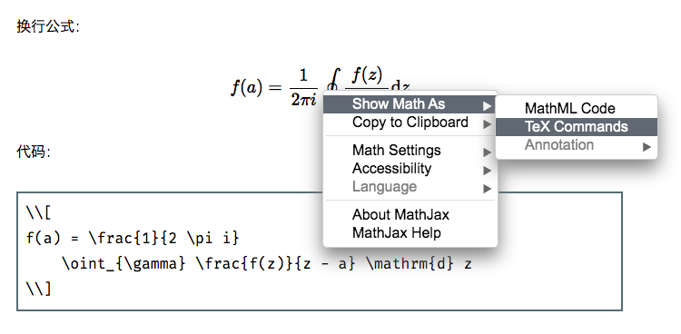

# 用 Markdown 写作

*写于 2021 年 3 月 13 日：*

博客的一些内容用 Markdown 写或许更合适．

## 用 Markdown 写作有什么好处？

首先，VS Code 支持 Markdown 的实时预览，因此可以算得上有非常好的编辑器支持．

其次，Markdown 写起来非常简单，适合做简单的排版，而且 Markdown 也能够被轻易地编译成 HTML 放到网页上面去显示．

以及，Markdown 基本上全是纯文字的，可被 git，可做版本控制．

## Markdown 相比 latex/PDF 方案怎么样？

Markdown 是即时预览的，编译时间忽略不计．

PDF 需要被编译出来，但是在其中可以嵌入字体、图片和数学公式，就显示效果来说更加有效．可以说 PDF 是自含的 (self-contain)，它不像 Markdown 转成 HTML 后，当用户阅读时，浏览器还要去拉取图片等资源．

Markdown 也可以输入数学公式，但是数学公式的显示效果肯定不如 latex/PDF 方案做出来的好．

Markdown 不能方便地自动编号，交叉引用等．

## 将如何与 Next.js/React.js 集成呢？

主要是基于 remark/remark-react.js 方案，它能够自动地将 Markdow 文本信息转成 `React.Component`，这样 Markdown 写成的文章就可以方便地转成 HTML 了．

## 显示图片的效果如何呢？

可以让图片以 100% 的宽度显示：


## 显示代码的效果如何呢？

可以让代码以 `block` 模式显示，并且加上边框，并为其设置等宽字体：

```
code {
    font-family: Fira Code, Monaco, monospace;
}

.paper {
    pre {
        code {
            display: block;
            border-style: solid;
            border-width: 2px;
            border-color: #586e75;
            padding: 0.5rem;
            line-height: 1.75rem;
            overflow: scroll;
        }
    }
}
```

顺便说，设置图片宽度的代码：

```
.article {
    p {
        img {
            max-width: 100%;
            display: block;
            margin-left: auto;
            margin-right: auto;
        }
    }
}
```

## 显示数学公式的效果

行内公式： \\( a \ne 0 \\)，代码：

```
行内公式： \\( a \ne 0 \\)，代码：
```

要输入两个反斜杠是因为 Markdown 本身的转义．

换行公式：

\\[
f(a) = \frac{1}{2 \pi i}
    \oint_{\gamma}
    \frac{f(z)}{z - a} \mathrm{d} z 
\\]

代码：

```
\\[
    f(a) = \frac{1}{2 \pi i}
        \oint_{\gamma} \frac{f(z)}{z - a} \mathrm{d} z 
\\]
```

可以看到，公式太长了分开写也是没问题的．

带编号的换行公式：

\begin{equation}
    \mathrm{e}^{i \theta} = \cos \theta + i \sin \, \theta
\end{equation}

代码：

```
\begin{equation}
    \mathrm{e}^{i \theta} = \cos \theta + i \sin \, \theta
\end{equation}
```

可以看到，原来 Markdown 加上 MathJax, 实现带编号的换行公式也是可以的．

另外，以下是截图：



可以看到右键点击数学公式是可以出现菜单的，MathJax 真的很强啊！

## 怎么配置 MathJax 的？

在 `head` 标签加入：

```
<script src="https://polyfill.io/v3/polyfill.min.js?features=es6"></script>
<script type="text/javascript" id="MathJax-script" async
    src="https://cdn.jsdelivr.net/npm/mathjax@3/es5/tex-chtml.js">
</script>
<script src="/mathJaxConfig.js"></script>
```

其中，`mathJaxConfig.js` 的内容是：

```
window.MathJax = { tex: { tags: 'ams' } };
```

因为这些脚本是远程加载的，所以当网络不好的时候，数学公式也要花好处时间才能就位．

## Front-Matter 怎么写？

Front-Matter 在静态网站生成器的语境中主要指文章的元数据(metadata)例如：标题、摘要、时间、标签、分类和作者信息等，我主要是将 Front-Matter 嵌入在 Markdown 中，并在 Markdown 内容被解析 (parse) 前用正则表达式将其分离：


如图是 Toml 格式的 Front-Matter，正则表达式的代码：

```
import vm from 'vm';

export function tomlAndMarkdownSeparator(mixedContent: string): ITomlAndMarkdown {
    const feature = /\-\-\-\n(?<tomlContent>[\s\S]+\n)\-\-\-\n\n(?<markdownContent>[\s\S]+)/g;
    const result = feature.exec(mixedContent);

    const toml = result?.groups?.tomlContent || "";
    const markdown = result?.groups?.markdownContent || "";

    return {
        toml, markdown
    };
}

export function parse(tomlContent: string): IFrontMatter {

    let context = {};
    const script = new vm.Script(tomlContent);
    vm.createContext(context);
    script.runInContext(context);

    return context as IFrontMatter;
}
```

这样做是因为我们需要必要的元信息来做 SEO．

## Markdown 怎么转成 HTML?

在 React 环境下，我们指的是，怎么将 Markdown 解析成 `React.Component`:

代码如下：

```
// 文件 markdowncompile.ts

import React from 'react';
import { __compile } from './markdowncompile_wrapped';

export function compile(markdownContent: string): React.Component {
    return __compile(markdownContent) as React.Component;
}
```

以及：

```
// 文件 markdowncompile_wrapped.js

import unified from 'unified'
import parse from 'remark-parse'
import remark2react from 'remark-react'

export function __compile(markdownString) {
    return unified()
        .use(parse)
        .use(remark2react)
        .processSync(markdownString)
        .result;
}
```

可以看到，我们做了一层包装，使得函数调用起来是 TypeScript 的，非常干净．

## 总结

Markdown 和 PDF 方案都有各自的好处，本站将会同时应用这两种方案．具体来说，对于像是教程，说明，文档这一类的，用 Markdown，对于稍微涉及到理论的，用 PDF.
