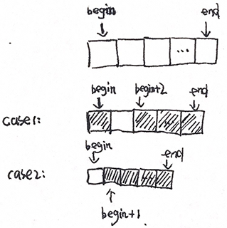
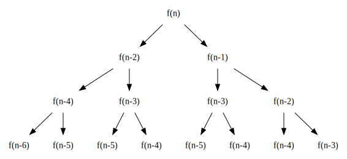
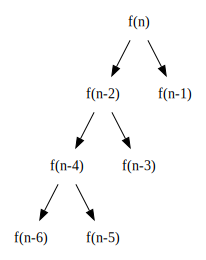

# DP: 以 House Robber 问题为例

*写于 2020 年 8 月 25 日：*

## 简介

DP 即 Dynamic Programming，也叫动态规划，在某些问题上，动规比穷举快．有时候，一个问题 \\( P \\) 可以分解成若干个子问题 \\( P_1, P_2, \cdots, P_n \\) ，这时候可能会出现这样的情况： \\( P_1 \\) 能拆成更小的子问题 \\( a_1, a_2, a_3, b_1 \\) ，而　\\( P_2 \\) 能拆成 \\( a_2, a_3, b_1, d_1 \\) ，我们就想复用重复出现的子问题 \\( a_2, a_3, b_1 \\) 的计算结果，使得通过减少不必要的重复计算提升效率．有时候我们也会先算 \\( a_1, a_2, a_3, b_1, d_1 \\) ，再去分别组合成 \\( P_1, P_2 \\) ，道理是一样的．

## 原问题

一个盗贼要去偷盗，他可以从一排屋子中选择偷盗哪几个屋子，这一排屋子的偷盗价值用一个数组来表示，例如，输入

```
nums = [7, 9, 2, 2, 3]
```

表示这个盗贼将要从这5个屋子中做出选择——偷盗哪些屋子，盗贼不能将两间相邻的屋子同时纳入选择，因为这样会触发报警器，问题就是，盗贼在不触发报警器的前提下，偷盗哪几间屋子能使得收获最大化？请返回盗贼通过做出最优选择所能得到的最大收获．

例如，盗贼不能将第1间屋子（价值7）和第2间屋子（价值9）都纳入选择，因为这两间屋子是相邻着的，如果它们在同一个晚上失窃，那么报警器就会被触发，盗贼可以只选择第1间屋子（价值7）和第3间屋子（价值2），这样他的收获是9，但这不是最优选择，因为从这排屋子中盗贼的最优选择能使他获得的收获是12，即选择第1间屋子（价值7）、第3间屋子（价值2），和第5间屋子（价值3）或者第2间屋子（价值9）和第3间屋子（价值3）．所以答案是12．

## 穷举：计算之本源

穷举并不是一开始就要被排除的方法，即使我们都知道穷举一般都会产生 TLE ( Time Limit Exceeded ) 提示，但是当问题规模 \\( n \\) 不大，或者实在想不出更好的办法的时候，或者当穷举的时间复杂度是 \\( O(n) \\) 的时候，它也算是一个解法．事实上正是穷举让我突然开始知道如何将 DP 方法运用于这题，或许，从某种意义上来说，DP 正算是「有技巧的穷举」吧．

如果输入数组的长度是0，我们就返回0，如果输入数组的长度是1，我们就直接返回第一个值，如果输入数组的长度是2，我们就返回输入数组的前两个值的最大值，这都没问题，所以，我们接下来考虑输入数组长度大于或等于3的情况：

决策空间包括了所有可能的选择，每一个选择也就是盗贼要选择进行偷盗的屋子的序号的组合，这些选择中既包括有效的（未触发报警器的）也包括无效的（触发了报警器的），我们要找的答案就在最优的有效选择上得出．假设输入数组长度大于等于3，也就是至少有3间屋子待选择，所有的有效选择可以分为两类：盗贼选择了偷盗第1间屋子，和盗贼没有选择偷盗第1间屋子，假如说盗贼选择了偷盗第 \\( 1 \\) 间屋子，那他能获得的最大利润就是第 \\( 1 \\) 间屋子的价值，加上他能从第 \\( 3 \\) 间屋子到第 \\( n \\) 间屋子中做出最优选择能得到的最大利润，假如说盗贼选择了不偷盗第 \\( 1 \\) 间屋子，那他能获得的最大利润，就是他能够从第 \\( 2 \\) 间屋子到第 \\( n \\) 间屋子中做出最优选择能得到的最大利润，我们用一个递归函数来表示这一规律或许更简单些：

```
public int MaxRobRecursive(int[] nums, int begin, int end) {
    var length = end - begin + 1;
    if (length == 0) {
        return 0;
    }
    else if (length == 1) {
        return nums[begin];
    }
    else if (length == 2) {
        return Math.Max(nums[begin], nums[end]);
    }
    else {
        // length >= 3
        var firstValue = nums[begin];
        var case1 = firstValue + this.MaxRobRecursive(nums, begin+2, end);
        var case2 = this.MaxRobRecursive(nums, begin+1, end);

        return Math.Max(case1, case2);
    }
}
```

参数中的 `nums` 表示一排屋子中每个屋子的偷盗价值，`begin` 是一个数组索引，`end` 也是一个数组索引，`MaxRobRecursive` 函数返回的是：假如盗贼能在序号为 `begin` 到 `end` 的这一些屋子中做出选择，那么它能获得的最大利润的值．`length` 表示当前这排房屋的个数．基本上就和我刚才说的一样．



图１最上边的是原数组，阴影部分是描出来的子数组，`case1` 和 `case2` 你可以看做是从阴影描出的子数组中做出最优选择能得到的最大利润，显然这个过程是递归的：如果我们打印 `length` 的值，我们会发现它是不断减小的，毕竟是递归嘛，也就是把一个大问题拆解成数个规模较小的问题，逐个击破，再整合最终答案．为了简便，我们用 `f(n)` 表示从 `nums` 数组的倒数 `n` 个元素（其实也就是对应 \\( n \\) 间屋子）中能做出的最优选择所产生的最大利润，我们上面列出的这个函数 `MaxRobRecursive` 最开始应该被这样调用 

```
var answer = MaxRobRecursive(nums, 0, nums.Length);
```

相当于计算 `f(n)`，然后呢，我们假设 `nums.Length` 也就是 `n` 是大于或等于 \\( 3 \\) 的，那么在 `MaxRobRecursive` 函数中程序就会跳到 `if` 语句的最后一个选项也就是最后那个 `else` 选项：

```
var case1 = firstValue + this.MaxRobRecursive(nums, begin+2, end);
var case2 = this.MaxRobRecursive(nums, begin+1, end);
```

这时，这就相当于开始计算 `f(n-2)` 和 `f(n-1)`，如果我们假设 `n-2` 是大于或等于 \\( 3 \\) 的话，那这两个计算又会被相应地划归为 `f(n-4)`，`f(n-3)`，`f(n-3)`，和 `f(n-2)`，这整个展开过程，也就是这颗计算树的演化过程，只要 `f(n-?)` 的参数 `n-?` 还大于或等于 \\( 3 \\) ，就会一直这样继续下去……



这颗计算树的深度，取决于 \\( n \\) ，但是这颗计算树的节点树，也就是在整个计算过程中，`MaxRobRecursive` 函数被递归调用的次数，当 \\( n \\) 增长时，是呈指数增长的，大致是 \\( 2^n \\) ，因为 \\( n \\) 基本上和这棵树的平均深度是线性关系，遍历计算树的一个节点（不只算叶节点）算是一个基本运算，而递归调用函数也需要在栈中开辟空间，所以，这个穷举的算法，它的时间复杂度和空间复杂度都是 \\( O(2^n) \\) ．

但是，从图２所示的这棵树中，你有没有发现什么规律，或者说现象呢？请仔细观察，接下来会讲到．

## 穷举的改进：带备忘录的穷举

这个树的生产规律，其实很简单：在每一个节点，检查 \\( f \\) 的括号中的值，如果这个值是 \\( 0 \\) ， \\( 1 \\) ，或者是 \\( 2 \\) ，那这个分支就停止生长，亦即不再创建左分支或又分支，否则就创建左分支（如果括号中的值大于或等于2）和右分支（如果括号中的值大于或等于1）．对任意 \\( x \geq 2 \\) 都有 \\( f(x) \to f(x-2), f(x) \to f(x-1) \\) ，对任意 \\( x \geq 1 \\) ，都有 \\( f(x) \to f(x-1) \\) ．

最主要的，是我们发现了树中出现了很多重复的节点！ \\( f(n-5) \\) 在最下边那一层出现了 \\( 3 \\) 次， \\( f(n-4) \\) 在整棵树出现了 \\( 4 \\) 次，也就是说，哪怕是之前已经计算过了的值，在之后往往还会被再重复计算多次，体现在程序运行过程中，就是 `MaxRobRecursive` 的很多次调用中参数都是相同的．说到这里，关于如何改进原来的穷举算法，已经变得很明显．最直接的，我们只需引入一个哈希表(Hash table)，相当于一个「备忘录」，把计算过的问题和得到的答案在「备忘录」中记下来即可，这样，在下一次的函数调用中，如果备忘录里面显示之前计算过这个值，那就把答案直接取出来就好了，就不用再次重复计算了．



如图３所示，引入哈希表之后，计算树的节点个数将缩减到 \\( O(n) \\) ，对于按照深度优先策略实现的递归函数 `MaxRobRecursive`，图３计算树当中的 \\( f(n-1) \\) ， \\( f(n-3) \\) ， \\( f(n-5) \\) 实质上都不必再往下展开，因为计算 \\( f(n-1) \\) 需要知道 \\( f(n-3) \\) 和 \\( f(n-2) \\) ，这都是已经计算过了的，在「备忘录」中就有，而从「备忘录」中「存」和「取」的时间复杂度都是 \\( O(1) \\) 的，所以 \\( f(n-3) \\) 和 \\( f(n-2) \\) 可以很快得到，所以 \\( f(n-1) \\) 也就可以很快得到，同样对于 \\( f(n-3) \\) 和 \\( f(n-5) \\) ．

以下是具体实现，主要就是在算法开始之前将「备忘录」初始化为 `Solution` 类的一个 `Hashtable` 类型的成员，然后在算法运行过程中首先尝试从备忘录中找答案，找不到再真正去计算：

```
using System;
using System.Collections;

public class Solution
{

    protected Hashtable answerNotes;

    public Solution() {
        this.answerNotes = new Hashtable();
    }

    public int MaxRobRecursiveWithNotes(int[] nums, int begin, int end) {
        var length = end - begin + 1;
        if (length == 0) {
            return 0;
        }
        else if (length == 1) {
            return nums[begin];
        }
        else if (length == 2) {
            return Math.Max(nums[begin], nums[end]);
        }
        else {
            // length >= 3

            if (this.answerNotes.ContainsKey(begin)) {
                int answerFromNotes = (int) this.answerNotes[begin];
                return answerFromNotes;
            }

            var firstValue = nums[begin];
            var case1 = firstValue + this.MaxRobRecursiveWithNotes(nums, begin+2, end);
            var case2 = this.MaxRobRecursiveWithNotes(nums, begin+1, end);

            var answer = Math.Max(case1, case2);
            this.answerNotes.Add(begin, answer);

            return answer;
        }
    }
}
```

和刚才的算法相比，你会发现，当输入数组的长度非常大的时候，改进版本的穷举要明显地快．

## 动态规划

递归固然好，简单易懂易实现，但是它最大的问题就是，拿我们写的这个「备忘录穷举」算法为例，要从栈上开辟大小与 \\( O(n) \\) 相当的内存空间，不同的硬件，不同的操作系统，不同的编程语言/运行环境，最大栈深度都是不同的，就算它不爆栈，我们也希望能主动把这 \\( O(n) \\) 大小的空间节省下来，而不是指望编译器/解释器/运行时自动替我们将递归程式优化为迭代程式．

其实很简单，按照递归的思想，想要计算 \\( f(n) \\) 就得先计算 \\( f(n-2) \\) 和 \\( f(n-1) \\) ，那为何不先计算 \\( f(n-2) \\) 和 \\( f(n-1) \\) ，然后再计算 \\( f(n) \\) 呢？其实是完全可行的！况且，这样子，我们连用来存储答案的「备忘录」都不用初始化了，而这个备忘录它所需要的空间也是 \\( O(n) \\) 的．

最开始 \\( f(n) \\) 被我们用来表示从 `nums` 数组后 \\( n \\) 个元素中能得到的答案：即，假设盗贼只能从 `nums` 数组的后 `n` 项里边选，那他能选到的最优解，说得再清楚一些就是，盗贼只能从一排房屋中的后 \\( n \\) 间房屋里面选择偷盗哪些房屋，在这种情况下他能得出的最优解，如今为了实现简便，我们可以重新把 \\( f(n) \\) 定义为能够从 `nums` 数组前 \\( n \\) 个元素中找到的最优解，比方说 `nums` 是

```
nums = [1, 2, 3, 4]
```

那么 \\( f(1) \\) 就是从 `nums` 数组的前 \\( 1 \\) 个元素中选出的最优解，很显然，是 \\( 1 \\) ，而如果是 \\( f(2) \\) 那就是从 `[1, 2]`里边选，显然不能选两个相邻的，所以只能选 `2`，最优解是 `2`，如果是 \\( f(3) \\) ，那就是从 `[1, 2, 3]` 里边选，那就选第1个（价值1）和第3个（价值3），最优解是 `4`，我们只不过换了个顺序，但是并不影响正确性，因为我们要的是最优选择的和，它显然与选项的次序无关．

我们先手动算一遍，现考虑输入

```
nums = [3, 7, 2, 8, 1, 9, 11]
```

这个输入数组是随机产生的，它代表一排房屋中每个房屋的偷盗价值，盗贼要从中选择一些要偷盗的房屋，而且不能选择相邻的房屋，并且使得选择的价值之和最大化．首先 \\( f(1) \\) 很容易计算，只能从 `[3]` 里面选，不存在相邻的，那自然就是 `3`，也就是 \\( f(1)=3 \\) ．其次是 \\( f(2) \\) ，要从 `[3, 7]` 里面选偷盗哪些（那间）房屋，自然是价值最大的，所以 \\( f(2) = 7 \\) ．之后，我们有自然规律可循．

\\( f(3) \\) 也就是从 `[3, 7, 2]` 代表的这 \\( 3 \\) 间房屋中选择偷盗哪几间，前面我们其实已经讨论过了，很容易就知道：

\\[
f(3) = \max \{ f(1) + 2, f(2) \}
\\]

并且，其实对于一般的 \\( n \geq 3 \\) 都有

\\[
f(n) = \max \{ f(n-2) + nums[n], f(n-1) \}
\\]

这一点我们已经在前面的递归函数中以代码的形式表达过了（只不过那个顺序是反的，是从右往左的，而这个是从左往右的），这个公式呢，在动态规划中也叫「状态转移公式」，不过你不用知道「状态转移公式」具体是什么意思，你只用知道，对于我们现在讨论的这个问题，要计算 \\( f(n) \\) ，我们就可以根据这个公式，以迭代的方式，先计算 \\( f(n-2) \\) ，再计算 \\( f(n-1) \\) ，再计算 \\( f(n) \\) ．

所以， \\( f(3) \\) 就等于 \\( 7 \\) ，因为

\begin{align*}
f(3) &= \max \{ f(1) + 2, f(2) \} \\nonumber \\\\
&= \max \{ 3+2, 7 \} \\nonumber \\\\
&= \max \{5, 7 \} \\nonumber \\\\
&= 7
\end{align*}

类似地，我们可以计算 \\( f(4) \\)

\begin{align*}
f(4) &= \max \{ f(2) + 8, f(3) \} \\nonumber \\\\
&= \max \{ 7 + 8, 7 \} \\nonumber \\\\
&= \max \{ 15, 7 \} \\nonumber \\\\
&= 15
\end{align*}

你看，不管是计算 \\( f(1) \\) ， \\( f(2) \\) ，还是 \\( f(3) \\) ，或者 \\( f(4) \\) ，所需要的步骤数都是常数量级的，这是因为在计算 \\( f(4) \\) 的时候， \\( f(2) \\) 和 \\( f(3) \\) 都已经存储在两个临时状态变量中的，可以直接读取，对于更大的 \\( n \\) 也是类似的道理，也有 \\( f(n-2) \\) 和 \\( f(n-1) \\) 分别存储在临时状态变量中可供直接读取，自然， \\( n \\) 步这种常数量级的计算，其时间复杂度就是 \\( O(n) \\) ，是线性的．而我们并没有另外再开辟一个与原数组长度相当的存储空间，只是定义了几个变量，所以空间复杂的是 \\( O(1) \\) ．算法的时间复杂度和空间复杂度从最开始的 \\( (O(2^n), O(2^n)) \\) 到「备忘录穷举」的 \\( (O(n), O(n)) \\) ，再到现在的 \\( (O(n), O(1)) \\) ，我们确实没白费力气．

以下是具体的C#实现：

```
public int RobByDynamicPrograming(int[] nums) {
    if (nums.Length == 0) {
        return 0;
    }
    else if (nums.Length == 1) {
        return nums[0];
    }
    else if (nums.Length == 2) {
        return Math.Max(nums[0], nums[1]);
    }
    else {
        // now we have nums.Length >= 3
        int nMinus2 = nums[0];  // answer for Rob(n-2)
        int nMinus1 = Math.Max(nums[0], nums[1]);  // answer for Rob(n-1)
        int current = 0; // answer for Rob(n)
        for (var i = 2; i < nums.Length; i++) {
            current = Math.Max(nMinus2+nums[i], nMinus1);
            nMinus2 = nMinus1;
            nMinus1 = current;
        }

        return current;
    }
}
```

确实也像我们所描述的这般简单．

## 总结

只要不把动规想象得那么难就可以理解了．