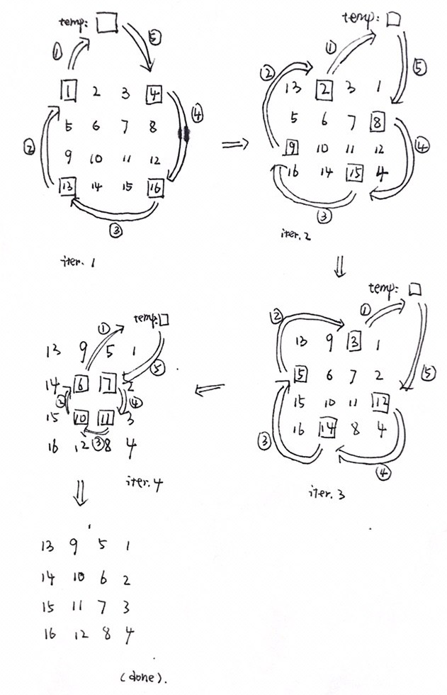

# 图片旋转问题

*写于 2020 年 8 月 17 日：*

当图片的像素不算太大的时候，我们可以将整张图片完全读入到内存中，并且以二维数组的形式存储，通过原地(In-place)修改数组中的元素，我们可以对图片进行「旋转」变换．

## 问题引出

给定一个二维数组：

```
[
    [1, 2, 3],
    [4, 5, 6],
    [7, 8, 9]
]
```

对上述数组进行90°旋转将得到：

```
[
    [7, 4, 1],
    [8, 5, 2],
    [9, 6, 3]
]
```

限制只能对所给数组进行原地(In place)编辑，而不能分配额外的数组或堆栈空间，写出空间复杂度是 \\( O(1) \\) 的算法对输入的「图片」进行旋转．

## 分析和思路

旋转数组也有些类似于线性代数中矩阵的转置（但看起来也不完全相同），一开始可能会被「必须通过原地编辑来完成」这个限制所难到，不过，只要我们稍微有耐心，还是可以看出具体应该如何一步步实现数组的旋转的．我们来看这个二维数组是怎么转动的——在仅能够互换数组内部的元素的条件限制下：



整个大概的过程就是如图１所示：如果数组的宽度（我们假设数组是方形的也就是长宽相等）是\\( 0 \\)或者\\( 1 \\)那就不必操作，如果宽度大于等于\\( 2 \\)，我们就从最外层开始做起，现在比如说数组的宽度是\\( 4 \\)，好比图１中的 iter. 1 所示，我们首先定位到四个元素，分别是当前层的顶面的第一个元素，右面的第一个元素，底面的第一个元素，和左面的第一个元素，之后我们就分别记着四个元素为 up 元素，right 元素，down 元素，和 left 元素，看具体的语境，有时候我们具体指的是数组下标，有时候也指元素本身，然后，我们将 up 元素（也就是 1）写到临时存储（也就是 tmp 所示区域），再将 left 元素写到 up 元素的位置，再将 down 元素写到 left 元素的位置，再将 right 元素写到 down 元素的位置，最后将 tmp 区域的元素（最开始是１）写入到 right 元素的位置，你发现，我们已经将最外层，每一面的第一个元素都相应地顺时针转了90°了！你看到，原先顶面的 1 转到了右面的 4 的位置，而右面的 4 转到了底面的 16 的位置，底面的 16 又转到了左面的 13 的位置，最后左面的 13 又转到了顶面的 1 的位置——这不就类似于群论里面的「轮换」(Cycle)吗！？

在 iter. 2，我们同样是在最外层操作，这次我们定位到的是最外层的每个面的第二个元素，也就是 2，8，15，和9（如图所示），将它们按照上一段话我们描述的方式旋转后，数组变为 iter. 3 所示，可以发现这 4 个元素也同样旋转了90°，接下来是旋转每一个面的第三个元素，和之前的两个元素差不多．

因为这个数组的长宽都是\\( 4 \\)，所以，最外层我们要做\\( 3 \\)遍这样的轮换：先将每一个面的第\\( 1 \\)个元素轮换，再将每一个面的第\\( 2 \\)个面试轮换，再将每一个面的第\\( 3 \\)个元素轮换，一般来说，容易理解：如果数组的宽度是\\( n \\)，那么我们要做\\( n-1 \\)遍这种轮换，做完之后，能够使最外层顺时针旋转90°，而转完最外层之后，里面的就是\\( n-2 \times n-2 \\)的数组，我们可以选择递归，也可以选择使用循环语句来处理接下来的情况——因为这和前面是类似的．只不过，如果使用递归的话，严格来说就违背了不能额外开拓空间的显著，基本上，假如说用递归的方法，函数调用的深度是和\\( n \\)正相关的，等于说我们要在栈上分配大约为\\( O(n) \\)大小的空间，而采用迭代的方法则能够保持\\( O(1) \\)的空间复杂度．

在图１中我们还看到，iter. 1　其实是最外层的第一轮操作，而 iter. 4 则是里边层（也就是从外往里数第二层）的第一轮操作，每一轮操作，按照我们一个一个元素进行轮换的逻辑，实际上首先就要求我们要正确初始化这四个元素的位置坐标，现就顶层的第一个元素来说，在最外部那一层，一开始（在 iter. 1 ）已经进行了\\( 0 \\)轮操作，

```
let mut round = 0;
```

顶层元素的坐标一开始（在 iter. 1）就是

```
let up_i = round;
let mut up_j = round;
```

而其余三个坐标则可以根据当前层的宽度计算出来，并且要知道最外层的宽度等于数组的宽度，第二层的宽度等于数组的宽度减去二，再里层的宽度再减去二，以此类推；我们用 (up_i, up_j)，(right_i, right_j)，(down_i, down_j)，和 (left_i, left_j) 分别表示 up 元素，right 元素， down 元素，和 left 元素的坐标数组，再用 current_levels 表示当前所处的层数，当处在最外层时：current_levels 等于数组宽度，每往里一层 current_levels 就递减 2，同时 round 递增 1．

```
let mut right_i: usize = up_i;
let right_j: usize = up_j + current_levels - 1;
let down_i: usize = up_i + current_levels - 1;
let mut down_j: usize = up_j + current_levels - 1;
let mut left_i: usize = up_i + current_levels - 1;
let left_j: usize = up_j;
```

坐标的计算差不多就是这个思路，而对于轮换的实现，也很简单：因为我们有四个位置的明确的坐标：

```
let tmp = matrix[up_i][up_j];
matrix[up_i][up_j] = matrix[left_i][left_j];
matrix[left_i][left_j] = matrix[down_i][down_j];
matrix[down_i][down_j] = matrix[right_i][right_j];
matrix[right_i][right_j] = tmp;
```

轮换完当前层的的一组4个元素之后我们要轮换下一组4个元素，因此要更新一次坐标：

```
let mut i: usize = 0;
while i < current_levels-1 {

    let tmp = matrix[up_i][up_j];
    matrix[up_i][up_j] = matrix[left_i][left_j];
    matrix[left_i][left_j] = matrix[down_i][down_j];
    matrix[down_i][down_j] = matrix[right_i][right_j];
    matrix[right_i][right_j] = tmp;

    up_j = up_j + 1;
    right_i = right_i + 1;
    if down_j > 0 {
        down_j = down_j - 1;
    }
    if left_i > 0 {
        left_i = left_i - 1;
    }
    i = i + 1;
}
```

以上代码结合完整代码更容易理解．

## 编程实现

我们用 Rust 语言实现了文中所描述的这个算法，完整代码如下：

```
struct Solution {}

impl Solution {

    pub fn rotate(matrix: &mut Vec<Vec<i32>>) {

        let mut current_levels: usize = matrix.len();
        let mut round: usize = 0;
        while current_levels >= 2 {

            let up_i: usize = round;
            let mut up_j: usize = round;
            let mut right_i: usize = up_i;
            let right_j: usize = up_j + current_levels - 1;
            let down_i: usize = up_i + current_levels - 1;
            let mut down_j: usize = up_j + current_levels - 1;
            let mut left_i: usize = up_i + current_levels - 1;
            let left_j: usize = up_j;

            let mut i: usize = 0;
            while i < current_levels-1 {

                let tmp = matrix[up_i][up_j];
                matrix[up_i][up_j] = matrix[left_i][left_j];
                matrix[left_i][left_j] = matrix[down_i][down_j];
                matrix[down_i][down_j] = matrix[right_i][right_j];
                matrix[right_i][right_j] = tmp;

                up_j = up_j + 1;
                right_i = right_i + 1;
                if down_j > 0 {
                    down_j = down_j - 1;
                }
                if left_i > 0 {
                    left_i = left_i - 1;
                }
                i = i + 1;
            }

            round = round + 1;
            current_levels = current_levels - 2;
        }

    }
}

fn main() {

    let mut case0: Vec<Vec<i32>> = vec![
        vec![]
    ];
    Solution::rotate(&mut case0);
    println!("{:?}", case0);

    let mut case1: Vec<Vec<i32>> = vec![
        vec![1]
    ];
    Solution::rotate(&mut case1);
    println!("{:?}", case1);

    let mut case2: Vec<Vec<i32>> = vec![
        vec![1,2],
        vec![3,4]
    ];
    Solution::rotate(&mut case2);
    println!("{:?}", case2);

    let mut case3: Vec<Vec<i32>> = vec![
        vec![1,2,3],
        vec![4,5,6],
        vec![7,8,9]
    ];
    Solution::rotate(&mut case3);
    println!("{:?}", case3);

    let mut case4: Vec<Vec<i32>> = vec![
        vec![ 1, 2, 3, 4],
        vec![ 5, 6, 7, 8],
        vec![9, 10, 11, 12],
        vec![13, 14,15, 16]
    ];
    Solution::rotate(&mut case4);
    println!("{:?}", case4);

    let mut case5: Vec<Vec<i32>> = vec![
        vec![ 1, 2, 3, 4, 5],
        vec![6, 7, 8, 9, 10],
        vec![11, 12, 13, 14, 15],
        vec![16, 17, 18, 19, 20],
        vec![21, 22, 23, 24, 25]
    ];
    Solution::rotate(&mut case5);
    println!("{:?}", case5);

}
```

在 `main` 函数中我们主要是输入了一些测试数据用来测试实现是否正确，主要代码是位于 `Solution::rotate_image` 函数．这份代码可直接通过编译并运行，在 LeetCode 上也表现较好：


这样我们就了解了如何通过原地编辑一个数组来实现图片的旋转．