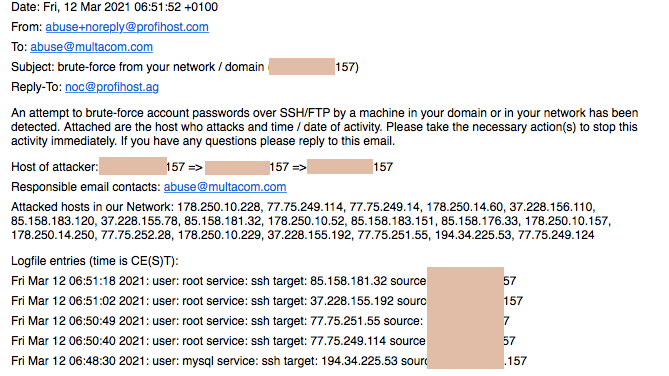
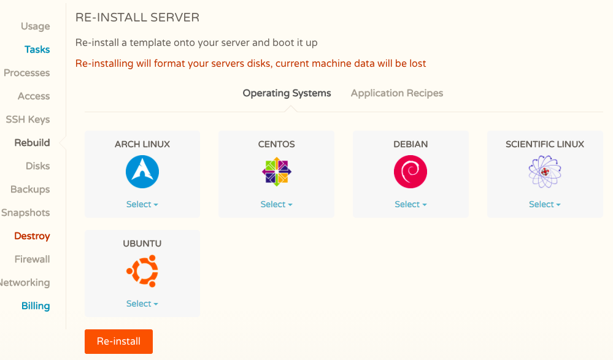
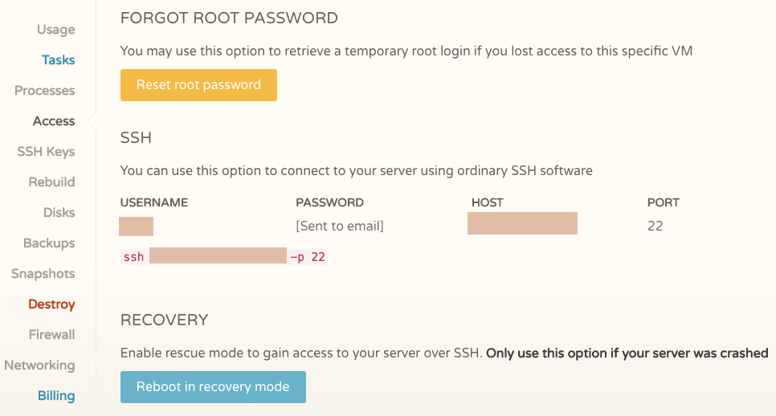
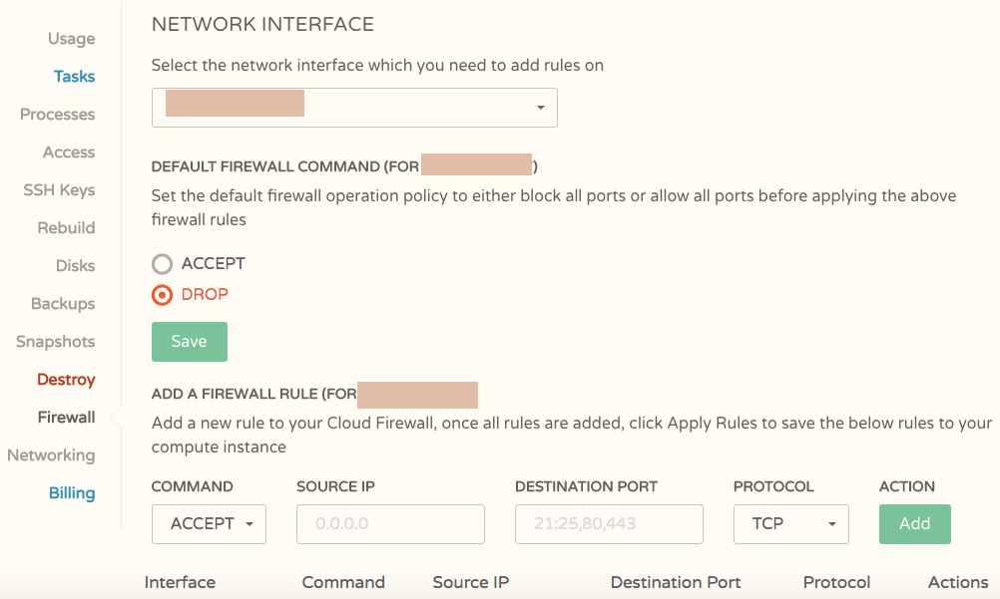
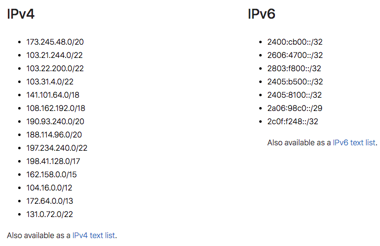

# 一次服务器被入侵的经历

*写于 2021 年 3 月 15 日：*

## 事件回顾

在北京时间 3 月 12 日晚上 11 点 19 分，我打开电脑，并且收到一封发自 CloudCone 的 Abuse Report 邮件：



这封邮件实际上是 06:51:52 +0100 发出的，也就是相当于北京时间的下午 1 点 51 分．内容大致是我的主机正在对它们网络中的主机进行 SSH 爆破，也就是短时间内尝试大量不同的用户名和密码组合以试图登录 (brute-force) ．它们 Profihost 首先是将滥用举报邮件发给 Multacom ，Multacome 也就是 CloudCone 背后的母公司，然后 CloudCone 将邮件转发给我，希望我快速做出回复．

## 处理方式

由于我的这台主机也是才刚重做系统不久，并且上面也没有什么重要文件，于是我又再次重做了系统：



完成后又进行关机操作，因为还可能有什么漏洞没有修补．由于我在 CloudCone 有两台 VPS ，并且这台 VPS 有 SSH 私钥可以登录到另外一台，意味着另外一台也可能也被入侵了，于是我将另外一台先关机（但没有重做系统，因为上面还有很多文件）．

确认被入侵的这一台，也就是 IP 地址后三位是 157 的这一台，记做主机 A，我在 CloudCone 的另一台 VPS 记做主机 B.

现在主机 A 已经完成了重装并且是处在关机状态，于是我以恢复模式 (Recovery Mode) 去启动主机 A：



不得不说 CloudCone 提供的这个功能非常实用．恢复模式相当于用一个提前预备好的临时启动盘去启动一台电脑，它启动的不是电脑硬盘上已经安装了的那个操作系统，所以恢复模式下启动大概率是安全的，更形象一点说，有点类似于以前安装 Windows 操作系统，用到的那种 PE 启动盘．

以恢复模式启动后，首先我在本地生成一对新的密钥：

```
ssh-keygen -f cloudcone
```

然后上传至主机 A．在主机 A 执行：

```
mkdir vda1
mount /dev/vda1 vda1
```

挂载系统盘到 `/root/vda1`，然后删除：

```
rm -rf /root/vda1/root/.ssh
```

并且用新的密钥对重新覆盖之：

```
cd vda1/root
mkdir -p .ssh
mv ../../clonecone* ./
```

添加公钥到 `authorized_keys` , 并且设置正确权限：

```
cd .ssh
cp cloudcone.pub authorized_keys
chmod 600 authorized_keys
```

修改 sshd 配置：

```
cd /root/vda1/etc/ssh
vi sshd_config
```

更改端口：

```
Port xxxxx
```

减少重试容许次数：

```
MaxAuthTries 3
```

禁用密码登录（因为我已经配置好了公钥）：

```
PasswordAuthentication no
```

设定允许登录用户列表：

```
AllowUsers root
```

然后保存退出．

由于已经确定好了 SSH 端口，所以可以设置防火墙白名单：



默认策略为: Drop, 允许进入的端口为上面设定的 SSH 监听端口．

然后退出恢复模式，以正常模式启动，用刚才创建的那对密钥的私钥登录，事实上，我将它添加到了用户的 SSH 配置文件 `~/.ssh/config` 中：

```
Host cloudcone-1
    Hostname xxx.xxx.xxx.157
    User root
    Port xxxxx
    IdentityFile ~/.ssh/cloudcone
```

那么 cloudcone-1 启动成功后就可以以：

```
ssh cloudcone-1
```

的方式免密登录，非常安全和方便．安全是因为我们用的是密钥验证方法，并且服务器上也已经禁用了密码验证方法．

以正常模式登陆后的首件事情就是更新软件包：

```
apt update
apt upgrade
```

如果 VPS 厂商不提供防火墙服务，也可以自己设置 [ufw](https://help.ubuntu.com/community/UFW), ufw 其实非常简单．

可以通过

```
journalctl -xe
```

来查看日志，如果 ufw 开启了日志，在这里能看到 ufw 拦截下来的数据包．也可以进入

```
/var/log
```

目录查看更多的日志．譬如说，用：

```
tail -F /var/log/ufw.log*
```

命令查看 ufw 的日志．用：

```
tail -F /var/log/auth.log
```

命令查看 sshd 的日志．

如果没有开启厂商的防火墙，也没有开启 ufw, 那么在 sshd 的日志文件里会看到很多登录失败的日志．如果只开了 ufw 并且开启了 ufw 的日志功能, 那么登录失败的日志会减少很多，但是会出现很多 ufw 的日志．如果开启了厂商的防火墙，那么 ufw 和 sshd 的日志都会减少很多．

对主机 A 做完这一切之后，我让主机 B 也以恢复模式启动，并且在主机 A 上创建一对临时密钥，将这对临时密钥上传到主机 B 上，然后让主机 A 去访问主机 B，在主机 B 上挂载系统盘到特定目录，并且通过 `scp` 命令将数据拷到主机 A，然后对主机 B 也做一遍对主机 A 做的．

由于主机 A 还要提供 HTTP 服务，所以开放了面向 [Cloudflare](https://www.cloudflare.com/ips/) 的白名单，放行所有来自 Cloudflare 的目标端口为 443 的流量：



仅当要申请 TLS 证书 (Let's Encrypt 证书) 时，才手动开放 80 端口．

## 事件反思

就在事件发生的几天之前我创建了一个弱密码用户，并且让这个弱密码用户成为了 sudoer , 当时也还没有设置 `sshd_config` 文件里的 `AllowUsers` 字段，所以很有可能就被到处泛滥的扫密码脚本攻破了．

平时也没有设置防火墙，并且 SSH 服务用的是默认的 22 端口，所以扫密码的成本很低．毕竟 SSH 服务默认是运行在 22 端口的，大家都知道这一点．而如果我设置成另外一个端口，那么攻击者首先要通过 `nmap` 来试探出哪一个端口是开放的．

没有开启定时备份，所以也就损失了一周的 umami 产生的数据，不过并不要紧．

个人觉得 CloudCone 提供的防火墙、定时备份和恢复模式功能都很好用，关键时刻很有用．

## 上升中的安全风险

主题：开源软件包被冒名顶替上传．

案例包括：

- [cupy-cuda112 #923](https://github.com/pypa/pypi-support/issues/923), 
- [twilio-npm](https://blog.sonatype.com/twilio-npm-is-brandjacking-malware-in-disguise)，

新闻报道：

- [Malicious Code Bombs Target Amazon, Lyft, Slack, Zillow](https://threatpost.com/malicious-code-bombs-amazon-lyft-slack-zillow/164455/), 
- [Dependency Confusion: How I Hacked Into Apple, Microsoft and Dozens of Other Companies](https://medium.com/@alex.birsan/dependency-confusion-4a5d60fec610),

关键词：

- Dependency Confusion, 
- Brandjacking,
- Typosquatting
